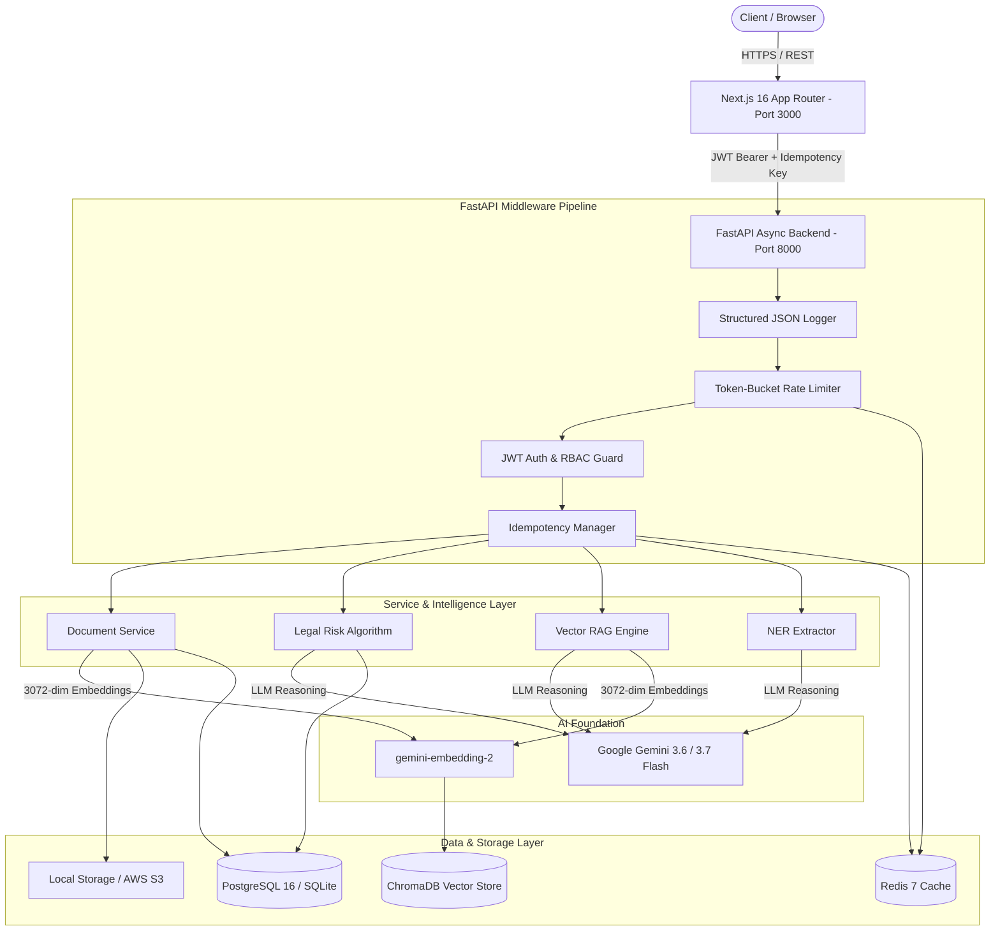

<p align="center">
  
  
  
  
  
  
  
</p>

<h1 align="center">⚖️ JURY-AI</h1>
<p align="center"><strong>Production-Grade Multi-Tenant AI Legal Document Intelligence & Risk Analysis Platform</strong></p>
<p align="center">Upload contracts, NDAs, and agreements. Get instant risk evaluations, 0–100 safety scores, AI-generated counter-proposals, named entity extraction, and grounded vector RAG Q&A — in milliseconds.</p>

---

## 📑 Table of Contents
- [Architecture & System Design](#-architecture--system-design)
- [Key Features](#-key-features)
- [AI & Legal Risk Algorithm](#-ai--legal-risk-algorithm)
- [Tech Stack](#️-tech-stack)
- [Quick Start Guide](#-quick-start-guide)
  - [Option 1: Zero-Config Local Run](#option-1-zero-config-local-development-fastest)
  - [Option 2: Docker Compose](#option-2-docker-compose)
- [Demo Credentials](#-demo-credentials)
- [API Reference](#-api-reference)
- [Project Directory Structure](#-project-directory-structure)
- [Testing & Quality Assurance](#-testing--quality-assurance)
- [Authors & Acknowledgments](#-authors--acknowledgments)

---

## 🏗️ Architecture & System Design

JURY-AI is designed using **Clean Layered Architecture (Routers → Schemas → Services → Repositories → ORM Models)** with complete multi-tenant organization isolation:



---

## ✨ Key Features

| Feature | Capability | Enterprise Standard |
|---|---|---|
| 📄 **Multimodal Contract Ingestion** | PDF (`PyMuPDF`), Word (`python-docx`), and Plain Text (`UTF-8`) stream parsing | Automatic text cleaning & chunking |
| 🛡️ **Automated Risk Scoring** | Dynamic **0–100 Safety Score** calculated via severity deduction matrix | Radial SVG gauge with live score animation |
| 🔍 **Clause Detection & Justifications** | Detects Critical, High, Medium, and Low risk contract terms | Plain-English legal rationale for every flag |
| 💡 **Safer Alternative Generation** | LLM drafts balanced, legally sound counter-clauses | Ready-to-copy counter-proposals |
| 🏷️ **Named Entity Recognition (NER)** | Extracts Parties, Critical Dates, Financial Caps, and Jurisdictions | Normalized JSON structure |
| 💬 **Vector RAG Q&A** | Grounded question-answering strictly bounded to contract excerpts | Prevents AI hallucination |
| 📝 **Plain-English Summarizer** | 2–3 sentence executive summary of contract purpose & key parties | Generated on-demand in <2 seconds |
| 🔐 **Enterprise Auth & RBAC** | Asymmetric JWT tokens (`access` + `refresh`), bcrypt password hashing | Roles: `Admin`, `Analyst`, `Viewer` |
| 🏢 **Multi-Tenant SaaS Isolation** | All documents, analyses, and ChromaDB vector spaces scoped by `org_id` | Strict database & vector boundary |
| ⚡ **Idempotency & Rate Limiting** | `X-Idempotency-Key` header with 24h Redis TTL | Razorpay-style duplicate protection |

---

## 🧠 AI & Legal Risk Algorithm

### Mathematical Scoring Formula
The contract safety score is deterministic and bounded between 0 and 100:

$$\text{Safety Score} = \max\left(0, 100 - \sum \text{Risk Deductions}\right)$$

| Severity Level | Deduction | Typical Triggers |
|---|---|---|
| 🚨 **Critical** | **$-25$ pts** | Unlimited liability, perpetual unilateral indemnity, total IP forfeiture, $1.00 liability caps |
| ⚠️ **High** | **$-15$ pts** | 24+ month non-competes, one-sided termination for convenience, aggressive data rights |
| 🟡 **Medium** | **$-5$ pts** | Net-60/90 payment terms without late interest, unilateral jurisdiction clauses |
| 🟢 **Low** | **$0$ pts** | Standard governing law boilerplate, mutual confidentiality covenants |

---

## 🛠️ Tech Stack

### Backend
* **Runtime**: Python 3.12+ (Async ASGI)
* **Framework**: FastAPI 0.115+
* **ORM**: SQLAlchemy 2.0 (Asyncio)
* **Databases**: PostgreSQL 16 (`asyncpg`) / SQLite (`aiosqlite` for zero-config local dev)
* **Migrations**: Alembic (async version tracking)
* **Vector Database**: ChromaDB (isolated per-org vector collections)
* **Caching & Idempotency**: Redis 7 (`redis.asyncio` with `fakeredis` local fallback)
* **AI & LLMs**: Google Gemini 3.6-Flash & 3.7-Flash (`google-genai` SDK)
* **Embeddings**: `gemini-embedding-2` (3072 dimensions)
* **Parsers**: PyMuPDF (`fitz`), `python-docx`
* **Logging**: `structlog` (structured JSON with `request_id` tracing)

### Frontend
* **Framework**: Next.js 16 (App Router) + React 19
* **Styling**: TailwindCSS 4 + Cyberpunk Dark Glassmorphism theme
* **Animations**: Framer Motion
* **Visualizations**: Recharts + Custom SVG Gauges
* **Icons**: Lucide React
* **Notifications**: React Hot Toast

---

## 🚀 Quick Start Guide

### Prerequisites
* **Python 3.12+**
* **Node.js 20+**
* **Google Gemini API Key** ([Get free key from Google AI Studio](https://aistudio.google.com/app/apikey))

---

### Option 1: Zero-Config Local Development (Fastest)

#### 1. Setup Backend
```powershell
cd backend

# Install Python dependencies
python -m pip install -r requirements.txt

# Configure your Gemini API key in backend/.env
# GOOGLE_API_KEY=your_gemini_api_key

# Seed demo contracts, users & analyses
python -m scripts.seed

# Start backend server
python -m uvicorn app.main:app --port 8000 --reload
```
> Backend will be live at **http://localhost:8000** (Swagger at `/docs`)

#### 2. Setup Frontend (In a New Terminal)
```powershell
cd frontend

# Install Node dependencies
npm install

# Start Next.js development server
npm run dev
```
> Frontend will be live at **http://localhost:3000**

---

### Option 2: Docker Compose

```powershell
# In project root directory
$env:GOOGLE_API_KEY="your_gemini_api_key"

# Build and start all 4 containers (Postgres, Redis, Backend, Frontend)
docker compose up --build

# Run database migrations and seed demo data in a separate terminal
docker compose exec backend python -m alembic upgrade head
docker compose exec backend python -m scripts.seed
```

---

## 🔑 Demo Credentials

| Role | Email | Password | Permissions |
|---|---|---|---|
| **Admin** | `admin@juryai.demo` | `DemoPass123!` | Full control, user role management, doc deletion |
| **Analyst** | `analyst@juryai.demo` | `DemoPass123!` | Upload contracts, trigger AI analysis, RAG Q&A |
| **Viewer** | `viewer@juryai.demo` | `DemoPass123!` | Read-only view of contracts, risk scores & summaries |

---

## 🔌 API Reference

| HTTP Method | Endpoint | Auth Required | Description |
|---|---|:---:|---|
| `POST` | `/api/v1/auth/register` | ❌ | Register new tenant organization & admin user |
| `POST` | `/api/v1/auth/login` | ❌ | Authenticate & receive JWT access + refresh tokens |
| `POST` | `/api/v1/auth/refresh` | ❌ | Rotate refresh token for a new access token |
| `GET` | `/api/v1/auth/me` | ✅ | Fetch currently authenticated user profile |
| `POST` | `/api/v1/documents/upload` | ✅ | Upload contract (`.pdf`, `.docx`, `.txt`), parse & index |
| `GET` | `/api/v1/documents` | ✅ | Paginated document listing for the tenant |
| `GET` | `/api/v1/documents/{id}` | ✅ | Retrieve document metadata & preview text |
| `DELETE` | `/api/v1/documents/{id}` | ✅ (Admin) | Soft-delete document |
| `POST` | `/api/v1/documents/{id}/analyze` | ✅ | Run idempotent AI risk analysis pipeline |
| `GET` | `/api/v1/documents/{id}/risk-score` | ✅ | Get 0–100 safety score, risk clauses & alternatives |
| `GET` | `/api/v1/documents/{id}/summary` | ✅ | Get 2–3 sentence plain-English executive summary |
| `GET` | `/api/v1/documents/{id}/entities` | ✅ | Extract Parties, Dates, Financial Caps & Jurisdictions |
| `POST` | `/api/v1/documents/{id}/query` | ✅ | Ask natural language questions via Vector RAG |
| `GET` | `/api/v1/admin/users` | ✅ (Admin) | List all users in organization |
| `PATCH` | `/api/v1/admin/users/{id}/role` | ✅ (Admin) | Update user role (`admin`, `analyst`, `viewer`) |
| `GET` | `/health` | ❌ | Health check (DB, Redis, ChromaDB, Gemini status) |

---

## 📁 Project Directory Structure

```
jury-ai/
├── docker-compose.yml              # 4-tier container orchestration
├── README.md                       # Platform documentation
│
├── backend/
│   ├── Dockerfile                  # 2-stage lightweight Python 3.12 image
│   ├── requirements.txt            # Production dependencies
│   ├── pyproject.toml              # Pytest & project metadata
│   ├── alembic.ini                 # Alembic configuration
│   ├── alembic/                    # Async database migration scripts
│   ├── scripts/
│   │   ├── seed.py                 # Enterprise demo data seeder
│   │   └── migrate.py              # Convenience migration runner
│   ├── tests/
│   │   └── test_core.py            # Automated test suite (29 test cases)
│   └── app/
│       ├── main.py                 # FastAPI application factory & /health probe
│       ├── config.py               # Pydantic BaseSettings environment loader
│       ├── dependencies.py         # Dependency Injection container
│       ├── core/
│       │   ├── constants.py        # StrEnums (UserRole, RiskLevel, AnalysisType)
│       │   ├── exceptions.py       # Custom exception hierarchy
│       │   └── security.py         # JWT generation, verification & bcrypt hashing
│       ├── integrations/
│       │   ├── gemini_client.py    # Google Gemini 3.6/3.7 & Embeddings client
│       │   ├── chroma_client.py    # Multi-tenant ChromaDB vector store
│       │   ├── redis_client.py     # Async Redis connection pool & fakeredis
│       │   └── s3_client.py        # S3 / local file storage abstraction
│       ├── models/                 # SQLAlchemy 2.0 ORM Declarative Models
│       ├── schemas/                # Pydantic v2 DTO validation models
│       ├── repositories/           # Generic & specialized async CRUD repositories
│       ├── services/               # Core business logic (Risk, RAG, NER, Auth)
│       ├── middleware/             # Logging, Rate Limiting, Idempotency & Auth
│       └── api/v1/                 # Versioned REST endpoint routers
│
└── frontend/
    ├── Dockerfile                  # Multi-stage standalone Next.js image
    ├── package.json
    └── src/
        ├── lib/api.js              # API client with automatic 401 JWT refresh
        ├── contexts/AuthContext.js # Global React Auth Provider
        ├── components/
        │   ├── Navbar.js           # Navigation bar with user badge
        │   ├── ProtectedRoute.js   # Client-side route authorization guard
        │   ├── SafetyGauge.js      # Animated SVG radial risk gauge (0-100)
        │   ├── RiskClauseCard.js   # Clause severity card with counter-proposal
        │   └── Skeleton.js         # Dark glass loading placeholders
        └── app/
            ├── layout.js           # Global layout & toast notification container
            ├── page.js             # Hero landing page with feature cards
            ├── login/page.js       # Glassmorphism login portal
            ├── register/page.js    # Multi-tenant registration portal
            └── dashboard/
                ├── page.js         # Contract repository table & upload modal
                └── [docId]/page.js  # Contract analysis dashboard & RAG chat
```

---

## 🧪 Testing & Quality Assurance

Run the automated test suite with **29 comprehensive unit tests**:

```powershell
cd backend
python -m pytest tests/test_core.py -v
```

```
============================= test session starts =============================
tests/test_core.py::TestRiskScoring::test_perfect_score_no_clauses PASSED [  3%]
tests/test_core.py::TestRiskScoring::test_single_critical_clause PASSED  [  6%]
tests/test_core.py::TestRiskScoring::test_single_high_clause PASSED      [ 10%]
tests/test_core.py::TestRiskScoring::test_single_medium_clause PASSED    [ 13%]
tests/test_core.py::TestRiskScoring::test_low_clause_no_deduction PASSED [ 17%]
tests/test_core.py::TestRiskScoring::test_mixed_clauses PASSED           [ 20%]
tests/test_core.py::TestRiskScoring::test_floor_at_zero PASSED           [ 24%]
tests/test_core.py::TestRiskScoring::test_unknown_risk_level_ignored PASSED [ 27%]
tests/test_core.py::TestRiskScoring::test_real_world_contract_score PASSED [ 31%]
tests/test_core.py::TestSecurityUtils::test_hash_password_returns_bcrypt PASSED [ 34%]
tests/test_core.py::TestSecurityUtils::test_verify_correct_password PASSED [ 37%]
tests/test_core.py::TestSecurityUtils::test_verify_wrong_password PASSED [ 41%]
tests/test_core.py::TestSecurityUtils::test_create_access_token PASSED   [ 44%]
tests/test_core.py::TestSecurityUtils::test_create_refresh_token PASSED  [ 48%]
tests/test_core.py::TestSecurityUtils::test_decode_invalid_token_raises PASSED [ 51%]
tests/test_core.py::TestConstants::test_user_roles PASSED                [ 55%]
tests/test_core.py::TestConstants::test_document_statuses PASSED         [ 58%]
tests/test_core.py::TestConstants::test_risk_levels PASSED               [ 62%]
tests/test_core.py::TestConstants::test_analysis_types PASSED            [ 65%]
tests/test_core.py::TestConstants::test_risk_weights_match_levels PASSED [ 68%]
tests/test_core.py::TestExceptions::test_not_found_exception PASSED      [ 72%]
tests/test_core.py::TestExceptions::test_unauthorized_exception PASSED   [ 75%]
tests/test_core.py::TestExceptions::test_forbidden_exception PASSED      [ 79%]
tests/test_core.py::TestExceptions::test_rate_limit_exception PASSED     [ 82%]
tests/test_core.py::TestExceptions::test_base_exception_inheritance PASSED [ 86%]
tests/test_core.py::TestSchemaValidation::test_register_request_valid PASSED [ 89%]
tests/test_core.py::TestSchemaValidation::test_register_request_short_password PASSED [ 93%]
tests/test_core.py::TestSchemaValidation::test_register_request_invalid_email PASSED [ 96%]
tests/test_core.py::TestSchemaValidation::test_query_request_valid PASSED [100%]

============================= 29 passed in 1.14s ==============================
```

---

## 👥 Authors & Acknowledgments

Developed as a Final Year Capstone Project at **Dayananda Sagar Academy of Technology & Management (DSATM), Bengaluru**.

* **Gaurav Jha** — *Lead Developer & System Architect*
* **Kalash Verma** — *Backend & Database Developer*
* **Komal Raj** — *Frontend & UI/UX Developer*
* **Krish Patel** — *AI/ML Integration Engineer*

---

<p align="center">
  <strong>⚖️ JURY-AI — Intelligent Contract Evaluation for Modern Legal & Engineering Teams</strong>
</p>
